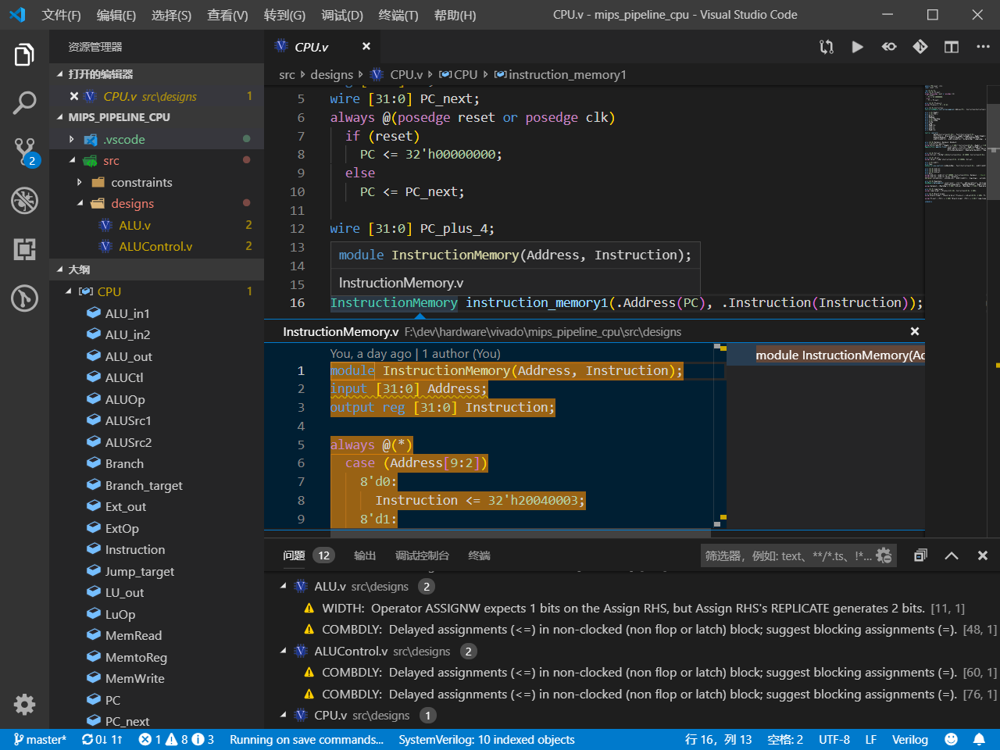
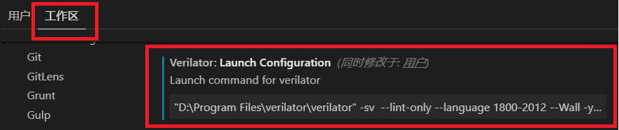

# VSCode Verilog Integration
> 本教程的另一地址： https://www.raineggplant.com/vscode-verilog-integration.html

---

**Update 20.08.11**

[@duskmoon314](https://github.com/duskmoon314) 提供了一个更详细的使用说明，并且做了一些扩展。[点击查看](https://mp.weixin.qq.com/s/_Un7dbGjhJR90ILFQd-HrA)

---

本教程会介绍如何使用 VSCode 舒适地开发 Verilog。经过配置之后，你将得到：

- 语法高亮
- 代码检查
- 自动补全
- 自动格式化
- 转到/查看定义
- 文件大纲
- 代码片段
- Git 版本控制
- ...




## Requirements

- 安装 [VSCode](https://code.visualstudio.com/) 。
- 下载 [iStyle Formatter](https://github.com/thomasrussellmurphy/istyle-verilog-formatter/releases) ，将其路径加入 `PATH` 或是随后在插件设置中指定路径。
- 下载 [Verilator](https://www.veripool.org/projects/verilator/wiki/Installing) ，将其路径加入 `PATH` 或是随后在插件设置中指定路径。

**注意**: 如果你是 Windows 用户且不熟悉 MinGW, 请直接使用 `executables` 中已编译好的 iStyle Formatter 和 Verilator。将它们放到你想要放置的路径即可。


## Extensions
为了增加 VSCode 对 `verilog` 的语言支持、并使得开发更加舒适等，需要安装如下插件。

- [SystemVerilog - Language Support](https://marketplace.visualstudio.com/items?itemName=eirikpre.systemverilog)
- [Verilog-formatter](https://marketplace.visualstudio.com/items?itemName=IsaacT.verilog-formatter)

安装后做如下设置：

- VSCode 文本编辑器
  
  - 勾选 Format On Save
  
- Verilog-formatter
  
  - 设置 iStyle 路径
  - 设置 Code Style
  
- SystemVerilog - Language Support

  - 勾选 `Compile On Save` , 这将使得保存时自动编译，进行代码检查。
  - 设置运行 Verilator 的参数

    **注意**：此处推荐更改打开的 Verilog 工程文件夹的工作区配置，而不是全局的用户配置。

    

    你需要输入的配置是：

    ```shell
    <PATH_TO_VERILATOR> -sv --lint-only --language 1800-2012 --Wall -y <PATH_TO_VERILOG_SRC_1> [-y <PATH_TO_VERILOG_SRC_2>]
    ```

    例如：

    ```shell
    "D:\Program Files\verilator\verilator" -sv --lint-only --language 1800-2012 --Wall -y "f:\example_project\src\designs"
    ```

做到这一步，就大功告成了。下面给出一些参考资料和文档，以供进一步定制 VSCode 需要。


## Advanced

非常推荐完成这一步。

使用  [barbedo/vivado-git](https://github.com/barbedo/vivado-git) , 用 Git 管理你的 Vivado 项目。


## Links

[Verilator Wiki](https://www.veripool.org/wiki/verilator) : Verilator 官方文档。

[Vivado加上VsCode让你的生活更美好](https://blog.csdn.net/qq_39498701/article/details/84668833) : 介绍了替换 Vivado 默认编辑器的方法和自动生成 Testbench 的插件。

